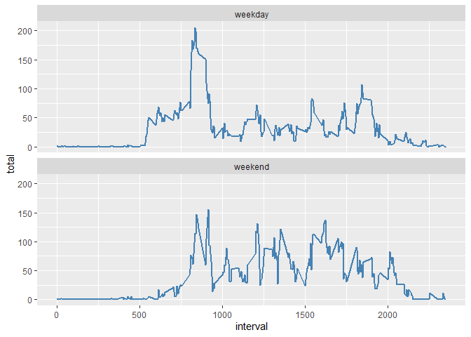

## Loading and preprocessing the data


```r
library(data.table)
setwd("C:/Users/larcos/Documents/Coursera/Curso5")
rowdata <- as.data.table(read.csv("activity.csv"))
```


## What is mean total number of steps taken per day?

```r
#Steps taken per day
Tsteps <- rowdata[!is.na(steps),.(total=sum(steps)), by=date]

#Histogram of steps taken per day
hist(Tsteps$total)
```

<!-- -->

```r
#Mean of steps taken per day
mean(Tsteps$total)
```

```
## [1] 10766.19
```

```r
#Median of steps taken per day
median(Tsteps$total)
```

```
## [1] 10765
```


## What is the average daily activity pattern?

```r
Binterval <- rowdata[!is.na(steps),.(total=mean(steps)), by=interval]
#Ploting data
plot(x=Binterval$interval, y=Binterval$total, type = "l")
```

<!-- -->

```r
#Interval whith Max steps
Binterval[total == max(Binterval$total, na.rm = TRUE)]$interval
```

```
## [1] 835
```


## Imputing missing values

```r
#the total number of rows with NA
sum(is.na(rowdata$steps))
```

```
## [1] 2304
```

```r
#for missing values we take the median of the respective interval
Medianinterval <- rowdata[!is.na(steps),.(med=median(steps)), keyby=interval]
result <- apply(rowdata, 1, function(x){ifelse(is.na(x[1]),Medianinterval[interval==as.numeric(x[3])]$med,as.numeric(x[1]))})
setdata <- data.table("steps"=result,rowdata[,2:3])

Tset.steps <- setdata[,.(total=sum(steps)), by=date]

#Histogram of steps taken per day
hist(Tset.steps$total)
```

<!-- -->

```r
#Mean of steps taken per day
mean(Tset.steps$total)
```

```
## [1] 9503.869
```

```r
#Median of steps taken per day
median(Tset.steps$total)
```

```
## [1] 10395
```


## Are there differences in activity patterns between weekdays and weekends?

```r
finsemana <- c("sábado", "domingo")
dias <- weekdays(as.Date(setdata$date,"%Y-%m-%d"))
setdata$type <- as.factor(ifelse(dias %in% finsemana,"weekend", "weekday"))

data2graph <- setdata[!is.na(steps),.(total=mean(steps)), by=.(interval,type)]
library(ggplot2)
ggplot(data = data2graph, aes(interval, total)) +
  geom_line(color = "steelblue", size = 1) +
  facet_wrap(~ type, nrow = 2, ncol = 1)
```

<!-- -->


